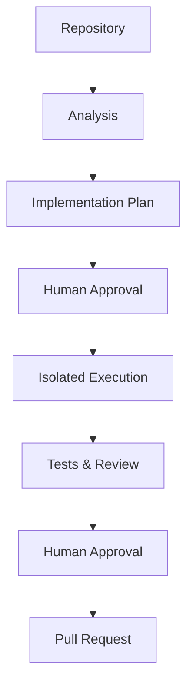
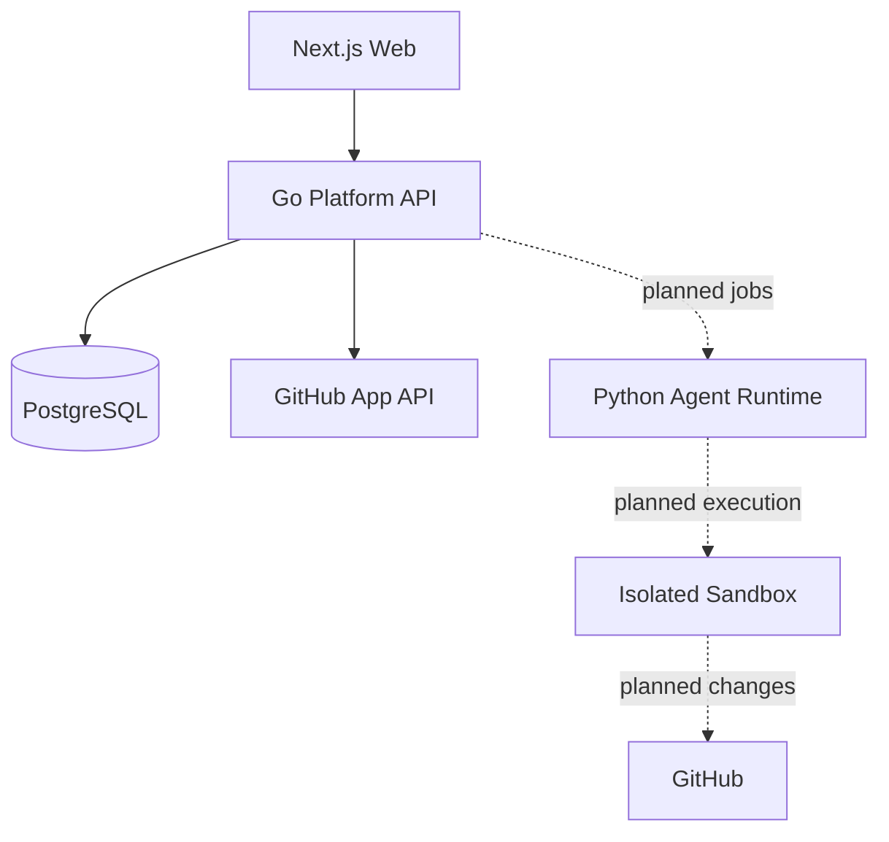

# DevPilot

**Human-supervised agentic software engineering.**

DevPilot is an open-source software engineering platform designed to analyze repositories, plan software changes, execute approved engineering work in isolated environments, validate results, and prepare reviewable pull requests.

## Current status

DevPilot is under active development. Autonomous repository work is not available yet.

Currently implemented:

- Production-oriented monorepo foundation
- Next.js frontend and authenticated application shell
- Authoritative Go platform API
- Python agent-runtime foundation without active agent workflows
- PostgreSQL platform persistence and explicit migrations
- Organization-aware multi-tenancy
- Local password authentication and secure server-side sessions
- Organization-scoped authorization and durable audit events
- GitHub App installation lifecycle and cryptographically bound setup flow
- Verified, idempotent GitHub webhooks and on-demand repository synchronization
- Organization-isolated repository metadata catalog, including private repositories explicitly granted to the App
- GitHub Actions CI and a Docker Compose development environment

## Planned workflow

The target workflow is:



This workflow is planned and is not represented as working functionality today.

## Architecture



The Go API owns platform policy and durable state. PostgreSQL is the system of record. Redis is available for future ephemeral coordination only. The Python runtime is reserved for bounded agent orchestration and does not own platform persistence.

GitHub access uses a least-privilege GitHub App with read-only repository metadata permission. App JWTs and short-lived installation tokens exist only in Go process memory and are never persisted or exposed to the browser.

## Technology

- Go and `net/http`
- Next.js, React, TypeScript, and Tailwind CSS
- Python 3.12 and Pydantic
- PostgreSQL
- Redis as available ephemeral infrastructure
- Docker Compose
- GitHub Actions

## Repository structure

```text
apps/web/                 Next.js web application
services/api/             Go platform API and migrations
services/agent-runtime/   Python runtime foundation
packages/contracts/       Language-neutral service contracts
infra/                    Local infrastructure assets
scripts/                  Development checks
.github/workflows/        Continuous integration
```

## Local development

Prerequisites: Go 1.26+, Python 3.12+, Node.js 22+, npm, and Docker Compose.

```bash
cp .env.example .env
make infra-up
make migrate
make bootstrap
```

Run the API and web application in separate terminals:

```bash
make api-run
make web-dev
```

Open `http://localhost:3000/register` to create a local user and organization. Registration, login, the protected application area, organization settings, and logout are implemented.

Run the validation suite with:

```bash
make check
make api-integration-test
```

Development defaults in `.env.example` are local placeholders only. Do not use them in production.

To exercise repository discovery, configure a development GitHub App with read-only repository metadata access, enable **Request user authorization (OAuth) during installation**, set its first callback URL to `/api/v1/integrations/github/callback`, and set its webhook URL to `/api/v1/integrations/github/webhook`. Provide the App client ID and client secret along with the App ID, private key, and webhook secret. Set `DEVPILOT_GITHUB_ENABLED=true` and replace every GitHub placeholder locally. Never commit credentials.

## Security philosophy

DevPilot is designed around human approval, server-enforced tenant isolation, audited privileged mutations, opaque server-side sessions, and least-privilege integrations. Future repository code will run only in ephemeral, resource-bounded isolated environments—not on the platform or agent-runtime hosts.

Security issues should be reported according to [SECURITY.md](SECURITY.md).

## Roadmap

- Repository analysis and implementation planning
- Human approval workflows
- Isolated execution environments
- Implementation, test, security, and code-review agents
- Reviewable pull-request workflow
- Evaluations, tracing, and operational observability

## License

DevPilot is licensed under the [Apache License 2.0](LICENSE).
